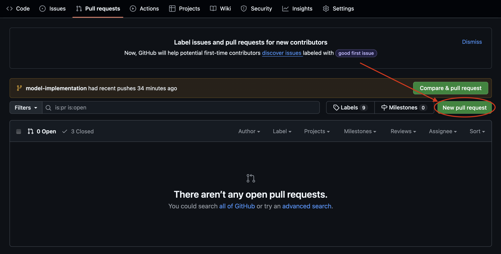
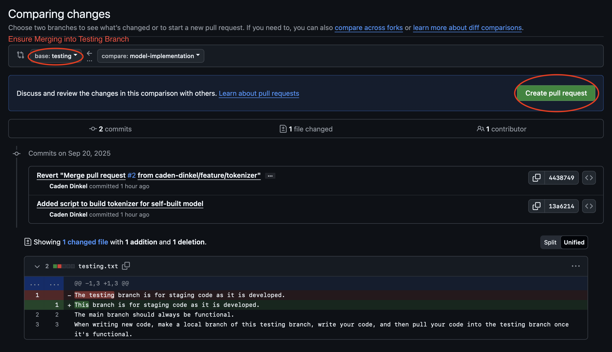

# To Make a Change (add a feature, fix bug, etc.)
## 1). Update local repository to newest testing branch.
```
git pull origin testing
```

## 2). Create a new branch for new change.
```
git checkout -b feature/{name}
```
### OR
```
git checkout -b bug_fix/{name} 
```

## 3). Make changes in local repository

## 4). Add, Commit, and Push changes to new branch
```
git add .
git commit -m "{Commit Message}"
```
```
git push origin feature/{name}
```
### OR
```
git push origin bug_fix/{name}
```

## 5). Make a pull request to testing branch from feature branch

### 1). Navigate to Create a Pull Request button.


### 2). Create a pull request, ensuring merging into correct branch.


